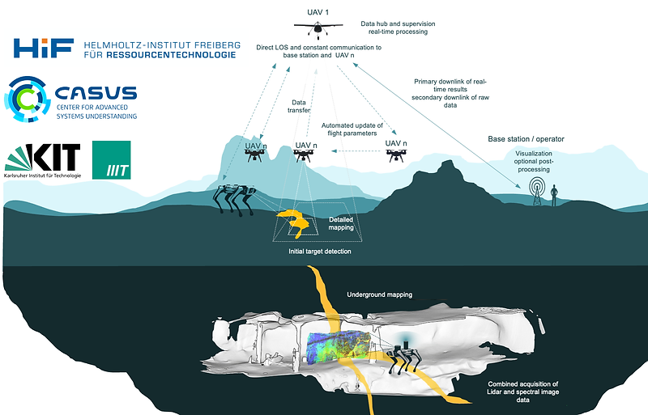

# autotarget  
**Quick links**: [`getting started guide`](https://github.com/Intelligent-Quads) | [`api source code`](/include/autotarget_functions.hpp) | [`api functions`](/docs/autotarget_functions.md) | [`demo`](/demo/DEMO-README.md) | [`intelligent-quads`](https://github.com/Intelligent-Quads/iq_tutorials)


autotarget* is an ongoing project aimed at developing an innovative drone swarm framework that offers maximum flexibility and interoperability with different types of swarm drones. These drones are equipped with on-board sensors and payloads. The design and manufacture of the drones and on-board sensors are carried out in-house at our DroneLab.



This framework aims to embed intelligence and facilitate the development of collaborative applications designed to operate in a distributed way and on a fleet of drones flying simultaneously. This enables us to rapidly carry out exploratory missions while collecting large quantities of multisource data, such as hyperspectral cameras in the visible, near infrared and short infrared, infrared thermal cameras, magnetometers, radiometers and Lidar sensors. We also develop and test new drone concepts, and share some of our drone systems as open hardware.

## 1-HIFExplo Community Discord

Join our team and contribute to this growing community of swarm application developers.
Check out our contributions and feel free to contact us on our [platform] (https://www.iexplo.space/) and [git] (https://github.com/hifexplo).


## 2-Organization of the Repository
* ### [`demo`](/demo/)
  This directory contains images and videos of prototypes, simulation tests and field tests with a swarm of real drones.
Simulations were carried out using Gazebo, APM, SITL and mavproxy. More videos concerning the demo are available here [`../demo/`](/demo).

* ### [`docs`](/docs/)
  It contains a well-detailed documentation of the functions available in the autotarget API and instructions on how to use some test programs. 
* ### [`include`](/include/)
  It contains all the external libraries and object headers that could be added to this project. The current version contains the control, command, communication and coverage path planning librairies: ``` autotarget_functions.hpp ```, ``` drone.h ```, ``` hilbert.h ```, ``` landmark.h ```, ``` point.h ```, ``` sense.h ```, ``` world_circle.h ```, ``` world_quadrilateral.h ```.
* ### [`models`](/models/)
  This folder holds the Gazebo models of type of drones in this project. New models can be added as required. For the moment, we have three type of drones: quadrotors (``` drone1 ... drone12```) and vtol (```standard_vtol```), fixed-wing (```winding_valley_heightmap```). They are equipped with on-board sensors (```drone_with_camera, drone_with_lidar, drone_with_sonar```).
* ### [`scripts`](/scripts/)
  This directory is used to implement python code. All python files must be added to this folder.
* ### [`svr`](/svr/)
  This folder contains the headers of the pre-configured services that the drones can call. The current version includes services to check the battery/flight state, the relative altitude, the compass HDG, the navigation with fixed satellite, and so on.
* ### [`worlds`](/worlds/)
  A set of Gazebo worlds models and maps that is used for testing the swarm navigation in simulation environment.
  The ```droneOnly.world``` file is used to simulated the programs with a single-uav swarm. The ```drone2Multi.world, drone2Multi.world, ... , drone6Multi.world``` are used to simulated a distributed ROS programs on respectively a 2-uav swarm, ..., 6-uav swarm. More videos about the swarm simulation are available here [` .../demo/real-world test`](/demo/real-world%20test/).

  
* * ### [`src`](/src/)
  It contains distributed ROS mission implementations. More information about the implemented ROS programs are available here [`../docs/autotarget_functions.md`](/docs/autotarget_functions.md).
## 3-How to Launch a Distributed Swarm Programs
We use two approaches to test the reliability of our framework. First, we run the application in a virtual environment. Then we move on to deployment on real drones. This allows us to minimize any risks or possible loss of time.

* ### [`Simulation testing`](/models/) 
We assume that Gazebo, mavproxy, sitl and ros are installed. Otherwise, please follow the instructions in this following link [`Intelligent-Quads`](https://github.com/Intelligent-Quads/iq_tutorials) for a complete configuration of the working environment.

How to call/use the API:

1. The first step is to launch the gazebo environment by choosing a world. For more information on how to install and run Gazelo, please consult the following link: https://dev.px4.io/v1.11_noredirect/en/ . *<GAZEBO_WORLD_LAUNCH_FILE>* is available from [../launch](/launch).

```python
	roslaunch autotarget <GAZEBO_WORLD_LAUNCH_FILE>
```
2. The second step is to launch the simulator software in the loop (SITL). For more information on how it works, please consult the following link: https://ardupilot.org/dev/docs/sitl-simulator-software-in-the-loop.html .
The .sh files for the launch commands are available here. The files with the name "fieldwork" are used to simulate the swarm in an open space in Halsbrücke (lat=50.959782,lon=13.404620).
```python
	./start-sitl-2uav-swarm.sh
```
	
```python
	./start-sitl-2uav-swarm-fieldwork.sh
```

3. In the third step, the drones are put into autopilot mode. This eliminates the need for operator intervention. In this case, the drones become autonomous, guided by the ROS signals. This is made possible by Ardupilot Mega (APM) https://www.ardupilot.co.uk/ .
*<APM_LAUNCH_FILE>* is available from [../launch](/launch).
```python
	roslaunch autotarget <APM_LAUNCH_FILE>
```
4. Finally, in the last step, we run the ros program. This assumes that you have configured the launch file to assign each ROS node (https://docs.ros.org/en/rolling/Releases.html) to a each drone in the swarm. *<ROS_PROGRAM_LAUNCH_FILE>* is also available from [../launch](/launch).
```python
	roslaunch autotarget <ROS_PROGRAM_LAUNCH_FILE>
```

* ### [`Real-world testing`](/models/)
This one is similar to the previous one. 

1. We'll just run the *apm-swarm.launch* on the real drones before running the ROS program. This launch file lets you set apm's communication parameters (Wi-Fi or Telemetry) specifically for each drone. 
```python
	roslaunch autotarget apm-swarm.launch
```
2. Run the ROS program deployment file. Unlike the previous case, they will be executed directly on the actual drones set in the *apm-swarm.launch* file.
```python
	roslaunch autotarget <ROS_PROGRAM_LAUNCH_FILE>
```
Below are the drones used for the actual tests. Once the API is fully operational, we'll switch to bigger drones with greater payload capacity.


## 4-Scientific Production
### Paper
* W. Y. H. Adoni, S. Lorenz, J. S. Fareedh, R. Gloaguen, and M. Bussmann, “Investigation of Autonomous Multi-UAV Systems for Target Detection in Distributed Environment: Current Developments and Open Challenges”, Drones, vol. 7, no. 4, p. 263, Apr. 2023 [`mdpi drones`](https://www.mdpi.com/2504-446X/7/4/263)
* W. Y. H. Adoni, S. Lorenz, J. S. Fareedh, T. D. Kühne, and R. Gloaguen, “Intelligent Swarm: Formalism, Design and Validation of Self-Organized UAVs based on Leader-Followers Paradigm for Distributed Mission Planning”, Journal of Intelligent & Robotic Systems, 2024 (under review)
* W. Y. H. Adoni, S. Lorenz, J. S. Fareedh, R. Gloaguen, and T. D. Kühne, “autotarget*: A Distributed Robot Operating System Framework for Autonomous Aerial Swarms”, The 21st International Conference on Ubiquitous Robots, June 24 - 27, 2024, New York, USA

### Communication
* W. Y. H. Adoni, "Concept and Design of Intelligent Swarm for Distributed Mission", PX4 autopilot Developer Summit 2023, Oct 20-21, 2023, New Orleans, Louisiana, USA [`px4summit2023`](https://px4summit2023.sched.com/speaker/w.adoni)
* W. Y. H. Adoni, "Autonomous Multi-UAV (Unmanned Aerial Vehicle) for the Characterization of Remote and Isolated Targets",
2023 HZDR Science Conference, Nov 15–16, 2023, Dresden, Germany [`hzdr2023conf`](https://events.hifis.net/event/883/sessions/2107/#20231115)


